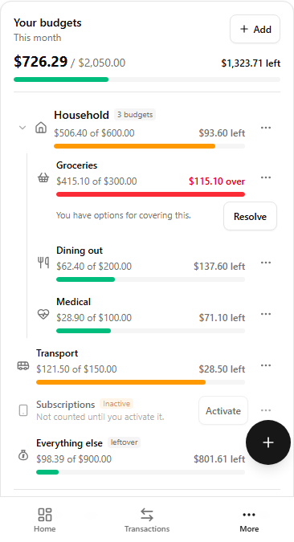
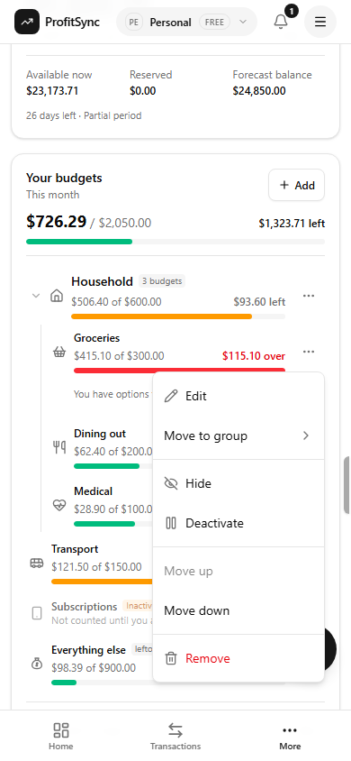
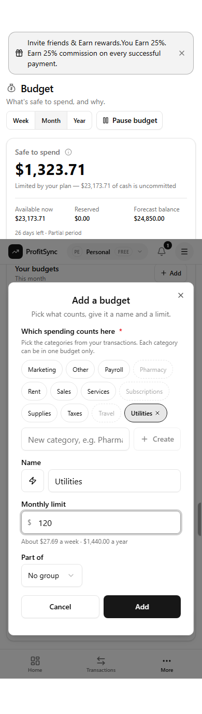
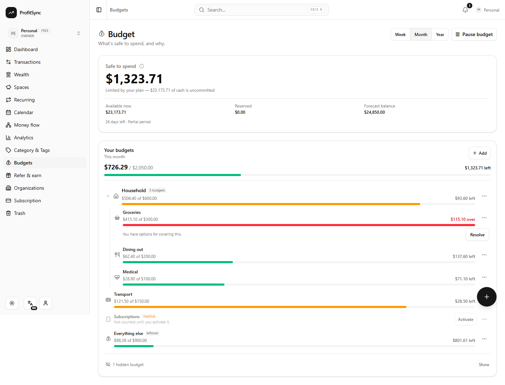

# Budget v2 — the budgets list

The `/budgets` page for a personal workspace was simplified on 2026-09-05 (approved by Carlo and
Maqbool). This document describes what the page is now, what the engine gained to support it, and
what left the page. The engine, the four numbers and the twelve invariants in the `budget-v2` skill
are unchanged; this is a layer on top of them.

## What the page is

One question, answered at a glance: **where am I with each budget?**

<p>



</p>
<p>

</p>

The page is the Safe-to-spend hero (unchanged), then **one card**:

- **Your budgets**, read through a **week / month / year** toggle in the page header, next to
  Pause budget.
- **Groups** (macro budgets such as *Household*) that add up the budgets inside them, then the
  ungrouped budgets, then **Everything else** (the catch-all) last.
- Every row shows the same three things: a bar, "spent of limit", and what is **left** or **over**.
  An overspent budget offers **Resolve** right under its bar, in the period view only.
- Everything else a budget can do is in its **⋯ menu**: Edit, Move to group, Hide / Show again,
  Deactivate / Activate, Move up / down, Remove.
- **Hidden** budgets fold into one line at the bottom ("2 hidden budgets · Show").
- **Inactive** budgets stay in place, greyed, with a one-tap **Activate**.

Bills, savings funds, debt payments, the income card, the unallocated card, the refund-review strip
and the "not supported yet" panel are **no longer laid out on this page**. The engine still reserves
for bills, funds and debt (the hero's explainer still says so, and an overdue bill still appears above
the list while it is owed), but they are no longer created from here. Their homes are Recurring,
Spaces and Debt & Loans.

## The model

| Concept | Storage | Meaning |
|---|---|---|
| **Budget** | `budget_envelopes` row, `section = 'flexible'`, `kind = 'category'` | A spending line: categories it claims, a limit, a name, an icon. Unchanged. |
| **Group** | `kind = 'group'`, `section = 'flexible'`, no target, no `match_keys` | A macro budget. Its planned/spent/remaining are the **sum of its ACTIVE children**. It never counts as an envelope of its own. |
| **Parent** | `parent_id` → a group in the same plan | One level only (`budget_envelopes_group_flat_check`). The catch-all is never grouped (`budget_envelopes_catch_all_ungrouped_check`). |
| **Hidden** | `hidden boolean` | **Display only.** A hidden budget counts everywhere; the page folds it away. |
| **Inactive** | `status = 'paused'` (existing value, now with semantics) | Counts **nowhere**: claims no categories (its spend falls back to the catch-all), plans nothing, out of every total, out of `sections.flexible`. A budget inside a paused group is inactive too (`effectivelyActive`). Reactivating mid-period inserts its allocation so it does not sit at zero until the next period. The catch-all cannot be paused (invariant 5). |

Migration **0063_budget_groups** adds `kind`, `parent_id`, `hidden`, the FK (ON DELETE SET NULL),
an index and four CHECKs. All additive; every existing row is an ungrouped, visible category.

## The view window

`GET /api/budgets/v2?window=week|month|year` re-windows **only** the `budgets` block of the payload.
The four numbers and the sections stay on the open period — safe-to-spend is a figure about *now*.
The default window matches the plan's cadence (weekly plan → week, everything else → month) and the
browser remembers the last choice per workspace (`ps_budget_window_<orgId>`).

- When the window **is** the open period (a monthly plan in the month view), every line reuses the
  period figures the hero used — same allocation (rollover and moved money included), same spend rows
  — so the list and the hero can never disagree. `budgets.is_period = true`, and Resolve is offered.
- Any other window is a fresh read of the ledger over that window (two more round trips), and the
  limit is **scaled from the authored target** via `targetForWindow()`: a monthly target reads exactly
  in the month view, and as its 12/52 and ×12 equivalents in the week and year views. The page says
  "Limits in this view are worked out from the limits you set."

Pure math in `src/lib/budget-math.ts` (tested in `src/lib/budget-list.test.ts`): `VIEW_WINDOWS`,
`defaultViewWindow`, `viewWindowFor`, `monthlyEquivalent`, `targetForWindow`, `sumBudgetLines`,
`effectivelyActive`.

## The payload

```ts
budgets: {
  window, start, end_exclusive, is_period,
  planned, spent, remaining, state,          // the whole list, active lines only
  groups: [{ id, kind:"group", name, icon, hidden, active, planned, spent, remaining, state, children: Item[] }],
  items:  Item[],                            // ungrouped, catch-all included
  hidden_count, inactive_count
}
Item = { id, kind:"category", name, icon, parent_id, hidden, active, is_catch_all, match_keys,
         authored_amount, authored_cadence, planned, spent, remaining, state }
```

Hidden lines are returned **in place**, flagged; inactive lines return with `active: false` and zero
figures. A child whose group vanished is returned at the top level rather than dropped — a budget must
never disappear from the page.

## Routes

- `POST /api/budgets/v2/envelopes` accepts `kind: "group"` (no target, no categories) and, for a
  category, `parent_id` (must be a live group of this plan; 404 otherwise).
- `PATCH /api/budgets/v2/envelopes/:id` accepts `parent_id` (null to ungroup), `hidden`, and
  `status: "active" | "paused"`. The catch-all refuses `parent_id` and `paused`. Audit actions:
  `envelope_deactivated`, `envelope_activated`.
- `DELETE` of a group detaches its children (soft delete, so the FK's SET NULL never fires).
- `POST /api/budgets/v2/envelopes/reorder` is unchanged; the page sends groups, each followed by its
  children, then the ungrouped lines.

## Adding a budget

`src/components/budget/BudgetItemDialog.tsx` replaces `EnvelopeDialog`. Order of decisions:
**which spending counts here** (category chips, with an inline "new category" field that POSTs to
`/api/categories`), then **name** (follows the first picked category until typed), then the **limit**
in the plan's rhythm ("Monthly limit") with its weekly and yearly equivalents, then **Part of** when
groups exist. The icon is suggested from the name and hidden behind one button. Remove lives in the
dialog and in the row menu, both behind a confirm.

## Retired from the page

`SavingsSection`, `AddCommitmentDialog`, `RefundReview`, `EnvelopeList` (drag-and-drop) and
`EnvelopeDialog` were deleted. Their routes (`/commitments`, `/occurrences`, `/contributions`,
`/refunds`) remain and are exercised by nothing in the UI except the overdue list. The catch-all's
default name for **new** plans is "Everything else"; existing plans keep their name.
